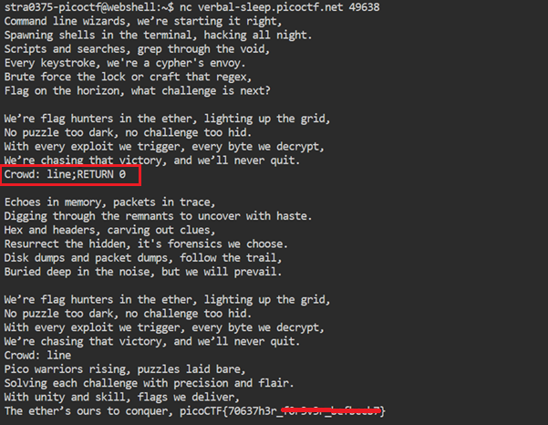

# Flag Hunters

**Platform:** picoCTF  
**Category:** Reverse Engineering 
**Difficulty:** Easy  
**Tags:** `python` `reverse egineering`

---

## Challenge Description

**Author:** syreal

**Description**
Lyrics jump from verses to the refrain kind of like a subroutine call. There's a hidden refrain this program doesn't print by default. Can you get it to print it? There might be something in it for you. The program's source code can be downloaded here.

Additional details will be available after launching your challenge instance.


```python
import re
import time


# Read in flag from file
flag = open('flag.txt', 'r').read()

secret_intro = \
'''Pico warriors rising, puzzles laid bare,
Solving each challenge with precision and flair.
With unity and skill, flags we deliver,
The ether’s ours to conquer, '''\
+ flag + '\n'


song_flag_hunters = secret_intro +\
'''

[REFRAIN]
We’re flag hunters in the ether, lighting up the grid,
No puzzle too dark, no challenge too hid.
With every exploit we trigger, every byte we decrypt,
We’re chasing that victory, and we’ll never quit.
CROWD (Singalong here!);
RETURN

[VERSE1]
Command line wizards, we’re starting it right,
Spawning shells in the terminal, hacking all night.
Scripts and searches, grep through the void,
Every keystroke, we're a cypher's envoy.
Brute force the lock or craft that regex,
Flag on the horizon, what challenge is next?

REFRAIN;

Echoes in memory, packets in trace,
Digging through the remnants to uncover with haste.
Hex and headers, carving out clues,
Resurrect the hidden, it's forensics we choose.
Disk dumps and packet dumps, follow the trail,
Buried deep in the noise, but we will prevail.

REFRAIN;

Binary sorcerers, let’s tear it apart,
Disassemble the code to reveal the dark heart.
From opcode to logic, tracing each line,
Emulate and break it, this key will be mine.
Debugging the maze, and I see through the deceit,
Patch it up right, and watch the lock release.

REFRAIN;

Ciphertext tumbling, breaking the spin,
Feistel or AES, we’re destined to win.
Frequency, padding, primes on the run,
Vigenère, RSA, cracking them for fun.
Shift the letters, matrices fall,
Decrypt that flag and hear the ether call.

REFRAIN;

SQL injection, XSS flow,
Map the backend out, let the database show.
Inspecting each cookie, fiddler in the fight,
Capturing requests, push the payload just right.
HTML's secrets, backdoors unlocked,
In the world wide labyrinth, we’re never lost.

REFRAIN;

Stack's overflowing, breaking the chain,
ROP gadget wizardry, ride it to fame.
Heap spray in silence, memory's plight,
Race the condition, crash it just right.
Shellcode ready, smashing the frame,
Control the instruction, flags call my name.

REFRAIN;

END;
'''

MAX_LINES = 100

def reader(song, startLabel):
  lip = 0
  start = 0
  refrain = 0
  refrain_return = 0
  finished = False

  # Get list of lyric lines
  song_lines = song.splitlines()
  
  # Find startLabel, refrain and refrain return
  for i in range(0, len(song_lines)):
    if song_lines[i] == startLabel:
      start = i + 1
    elif song_lines[i] == '[REFRAIN]':
      refrain = i + 1
    elif song_lines[i] == 'RETURN':
      refrain_return = i

  # Print lyrics
  line_count = 0
  lip = start
  while not finished and line_count < MAX_LINES:
    line_count += 1
    for line in song_lines[lip].split(';'):
      if line == '' and song_lines[lip] != '':
        continue
      if line == 'REFRAIN':
        song_lines[refrain_return] = 'RETURN ' + str(lip + 1)
        lip = refrain
      elif re.match(r"CROWD.*", line):
        crowd = input('Crowd: ')
        song_lines[lip] = 'Crowd: ' + crowd
        lip += 1
      elif re.match(r"RETURN [0-9]+", line):
        lip = int(line.split()[1])
      elif line == 'END':
        finished = True
      else:
        print(line, flush=True)
        time.sleep(0.5)
        lip += 1


reader(song_flag_hunters, '[VERSE1]')
```
---

## Reconnaissance

The source code reveals that the song lyrics are stored as a single string in `song_flag_hunters`. The lyrics are split into named sections:

- `secret_intro` — a hidden verse that **contains the flag**, stored at the very beginning of the string
- Normal song verses
- `[REFRAIN]` — the chorus section

The program exposes a `reader` function that takes two arguments: `song` and `startLabel`. It begins printing from the given label. At the bottom of the file it is called as:

```python
reader(song_flag_hunters, "[VERSE1]")
```

This means execution starts at `[VERSE1]`, completely skipping `secret_intro` and the flag.

---

## Solving the challenge

### 1. Understanding the interpreter
The printing loop works as follows:

- A counter `line_count` starts at `0` and increments each iteration; printing stops when `finished` is `True` or `line_count >= MAX_LINES`.
- Each song line is split on `;` into individual commands (uses ; as the separator): `for line in song_lines[lip].split(';')`.
- Special keywords are handled:
  - `if line == ‘REFRAIN’` handles the special keyword REFRAIN. It jumps the interpreter to the start of the `[REFRAIN]` section.
  - `elif re.match(r”CROWD.*”, line) ` uses regular expression to match if the current line starts with “CROWD” (which appears at the end of the REFRAIN) and if it does, it prompts for user input, then moves to the next line.
  - `elif re.match(r”RETURN [0-9]+”, line)` uses regular expression to set `lip` to the integer `n`, jumping the interpreter to that line number.

---

### 2. Injecting a RETURN via user input

We can use the RETURN keyword to point lip to the line that will print the flag. Because the `for` loop splits on `;`, anything typed at a `CROWD` prompt is inserted into the command stream. A semicolon-separated suffix is therefore parsed as a real command, not a literal string.

Since `secret_intro` starts at **line 0** of the song, we need to set `lip = 0`. When the program reaches a `CROWD` line and prompts for input, we supply:

```
anything;RETURN 0
```

The text before `;` is echoed back as the crowd response; `RETURN 0` is then executed as a command, resetting `lip` to 0. On the very next iteration the interpreter reads from line 0 — `secret_intro` — and the flag is printed.

In this example, when the program asks for user input, we supplied:

```
line;RETURN 0
```

The flag is printed, the next time the lyrics is echoed back



---

## Flag

```
picoCTF{70637h3r_xxxxxxx_xxxxxxxx}
```
*(Flag redacted)*

---

## Key takeaways

| # | Lesson |
|---|--------|
| 1 | **Command injection via delimiters**: when user input is split and evaluated as commands, an attacker can inject extra commands by including the delimiter (here `;`) in their inpu |
| 2 | A custom interpreter that supports a `RETURN`/jump instruction is essentially a programmable pointer — controlling it lets you reach any part of the data |
| 3 | Hidden data at offset 0 (or any fixed offset) can be exposed simply by resetting the instruction pointer to that offset |
| 4 | Always sanitise or reject delimiter characters in user-facing input fields before passing the input to an interpreter |


---
*← [Back to Reverse Engineering](../../) | [Back to picoCTF](../../../)*
