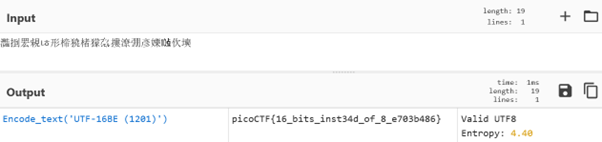
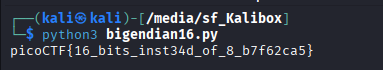

# Tranformation

**Platform:** picoCTF  
**Category:** Reverse Engineering 
**Difficulty:** Easy  
**Tags:** `cyberchef` `Big Endian`

---

## Challenge Description

**Author:** madStacks

**Description**

I wonder what this really is... enc ''.join([chr((ord(flag[i]) << 8) + ord(flag[i + 1])) for i in range(0, len(flag), 2)])

---

## Reconnaissance

Clicking on enc downloads a txt file which contains a single encoded string. It is a sequence of characters that does not immediately resemble ASCII text or a familiar encoding:

`灩捯䍔䙻ㄶ形楴獟楮獴㌴摟潦弸形㝦㘲捡㕽`

---

## Solving the challenge

### Method 1: CyberChef Magic (Intensive Mode)
Paste the string into [CyberChef](https://cyberchef.io/), select the **Magic** operation, and enable **Intensive mode**. CyberChef analyses the byte sequence and identifies the encoding as **UTF-16 Big Endian**, then decodes it automatically to reveal the flag.



---

### Method 2: Python

Once the encoding is identified, a short Python script reproduces the result:

```python
encoded = "灩捯䍔䙻ㄶ形楴獟楮獴㌴摟潦弸形㝦㘲捡㕽"

# Encode to bytes interpreting each character as a UTF-16-BE code unit
raw_bytes = encoded.encode('utf-16-be')

# Decode the resulting bytes as ASCII (or latin-1) to get the flag
flag = raw_bytes.decode('latin-1')
print(flag)
```



The `.encode('utf-16-be')` call converts the string into its raw big-endian byte representation. Because the original data was ASCII text that had been stored as UTF-16 BE code points, the raw bytes map directly back to readable ASCII characters.

---

## Flag

```
picoCTF{16_xxxx_xxxxxxx_xx_x_xxxxxxxx}
```
*(Flag redacted)*

---

## Key takeaways

| # | Lesson |
|---|--------|
| 1 | *UTF-16 Big Endian** stores each character as two bytes, with the most-significant byte first, a plain ASCII string encoded this way produces pairs of bytes where the first byte is `0x00` |
| 2 | CyberChef's **Magic** operation (intensive mode) is a powerful first step for unknown encodings |
| 3 | Python's `str.encode('utf-16-be')` and `bytes.decode(...)` make it straightforward to convert between Unicode representations and raw byte sequences |
| 4 | Recognising the `0x00` padding pattern in a hex dump is a quick manual signal that a string may be UTF-16 encoded |


---
*← [Back to Reverse Engineering](../../) | [Back to picoCTF](../../../)*
