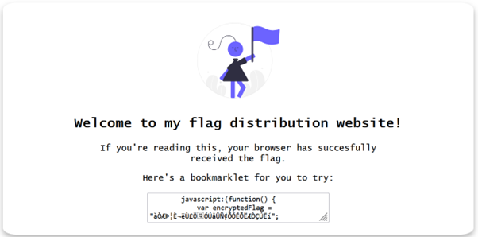
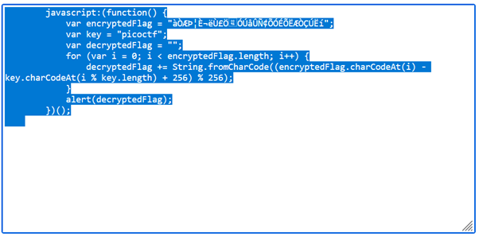
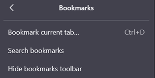
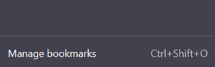
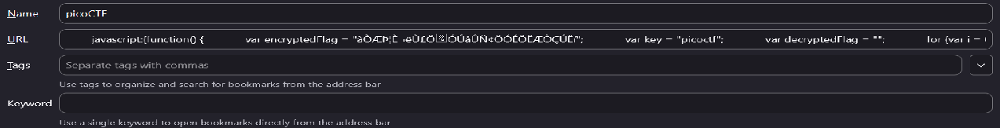
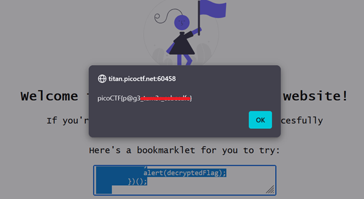

# Bookmarklet

**Platform:** picoCTF  
**Category:** Web Exploitation  
**Difficulty:** Easy  
**Tags:** `Bookmarklet` `JavaScript` `web exploitation` `client-side`

---

## Challenge Description

**Author:** Jeffery John

**Description**
Why search for the flag when I can make a bookmarklet to print it for me?

Additional details will be available after launching your challenge instance.

---

## Reconnaissance

Opening the challenge URL shows a page displaying a block of JavaScript code. 



---

## Solving the challenge

This is a bookmarklet challenge.

### 1. Copy the code

Click the code snippet on the page to copy it to your clipboard.



### 2. Create a new bookmark

In your browser, create a new bookmark ("Bookmark current tab" or use `Ctrl + D`).



### 3. Manage the bookmark

Manage the bookmark by clicking "Manage bookmarks or use `Ctrl + shift + O`. 
In the bookmark's URL/location field, delete whatever is there and paste the
JavaScript code. It should begin with `javascript:`. Give the bookmark a
name such as "picoCTF".




### 4. Run the bookmarklet

Stay on the challenge webpage. Run the bookmark. The
JavaScript runs in the context of the open page, reads or manipulates
something in the DOM, and displays the flag via an `alert()` pop-up.



---

## Flag

```
picoCTF{p@g3_xxxxxx_xxxxxxxx}
```
*(Flag redacted)*

---

## Key takeaways

| # | Lesson |
|---|--------|
| 1 | A **bookmarklet** is a bookmark whose URL is a `javascript:` URI — clicking it executes the code in the context of the current page |
| 2 | Bookmarklets can read and modify the page's DOM and any JavaScript variables that are in scope |
| 3 | This demonstrates why **client-side logic cannot be trusted** — a user can run arbitrary JavaScript against your page |
| 4 | Any secrets computed or stored in the browser's JavaScript environment are accessible to the end user |

---
*← [Back to Web Exploitation](../../) | [Back to picoCTF](../../../)*
