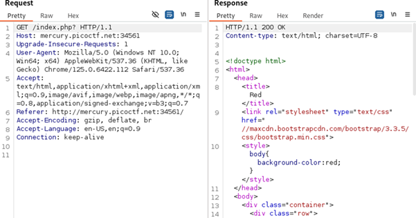
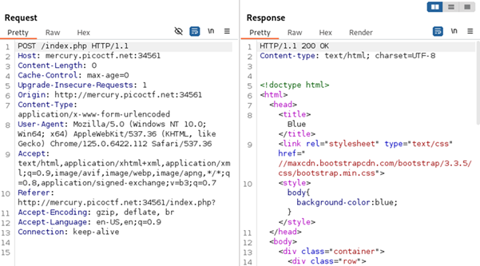
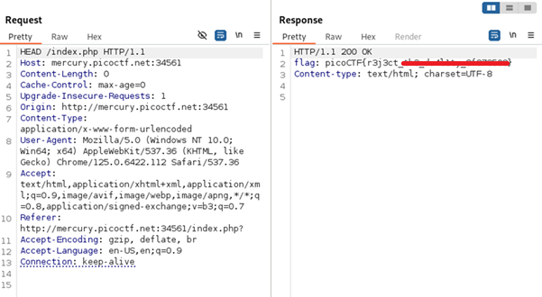

# GET aHEAD

**Platform:** picoCTF  
**Category:** Web Exploitation  
**Difficulty:** Easy  
**Tags:** `HTML request methods` `Burp Suite` 

---

## Challenge Description

**Author:** madStacks

**Description**

Find the flag being held on this server to get ahead of the competition

Additional details will be available after launching your challenge instance.

---

## Reconnaissance

Navigating to the challenge URL presents a webpage with two clickable options: **RED** and **BLUE**.

--- 


Nothing immediately obvious stands out when inspecting the source code.

---

## Solving the challenge

### 1. Intercept requests using Burp Suite

Open **Burp Suite** and intercept the requests when clicking each option:
   - Clicking **RED** sends a **GET** request.
   - Clicking **BLUE** sends a **POST** request.




---

### 2. Modify the request using Burp Suite

The challenge name hints at the **`HEAD`** HTTP request method. In Burp Repeater, change the request method to `HEAD` and send the request.

The flag is returned in the **response headers**.



---

## Flag

```
picoCTF{r3j3ct_xxx_xxxxxxx_xxxxxxxx}
```
*(Flag redacted)*

---

### HTTP Method Reference

| Method | Description |
|--------|-------------|
| `GET` | Retrieves data from the server. Sends parameters in the URL. Has no request body. |
| `POST` | Submits data to the server (e.g., form submission, file upload) to create or update a resource. Data is sent in the request body. |
| `HEAD` | Returns only the **headers** that a GET request would return with no response body. Used to check metadata about a resource (content type, size, last modified) without downloading the content itself. |

## Key takeaways

| # | Lesson |
|---|--------|
| 1 | HTTP supports many methods beyond `GET` and `POST`. **`HEAD`**, `PUT`, `DELETE`, `OPTIONS`, and `PATCH` are all standard and may be handled differently by the server|
| 2 | Always test non-standard HTTP methods against web application endpoints. A server might expose sensitive information or functionality through an unexpected method |
| 3 | **`HEAD`** is commonly used by download managers to check file size before downloading, or by clients to verify whether a resource has changed (via `Last-Modified` or `ETag` headers) |


---
*← [Back to Web Exploitation](../../) | [Back to picoCTF](../../../)*
