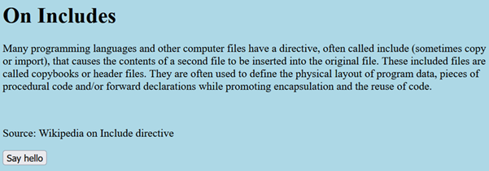
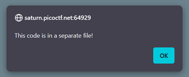
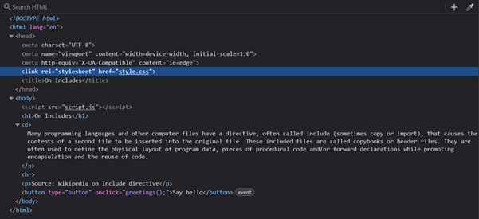
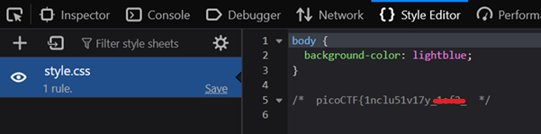
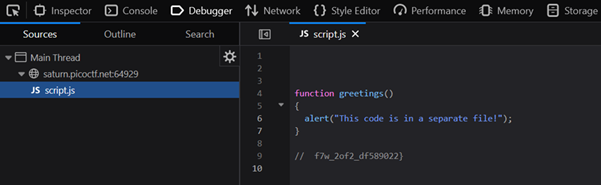

# Includes

**Platform:** picoCTF  
**Category:** Web Exploitation  
**Difficulty:** Easy  
**Tags:** `DevTools` `JavaScript` `CSS` `HTML inspection`

---

## Challenge Description

**Author:** LT 'syreal' Jones

**Description**
Can you get the flag?

Additional details will be available after launching your challenge instance.

---

## Reconnaissance

Navigating to the challenge URL shows a page explaining what the HTML
`include` (resource linking) concept means, along with a button. Clicking the
button produces an alert indicating that the code is in a separate file.

--- 




---

## Solving the challenge

The alert hints that the flag will be found in source code that may be added using an external file.

### 1. Open DevTools and check linked resources

Open DevTools. In the **Elements** panel, in the
`<head>` section, there are `<link>` and `<script>` tags pointing to
external files — a CSS stylesheet and a JavaScript file.



### 2. Navigate to each file and read the comments

Click each file path (or copy the URL and open it in a new tab) to view its
raw contents.

Alternatively, use the **Sources** (Chrome) or **Debugger** (Firefox) panel in
DevTools to browse all loaded files.

Both files contain comments with part of the flag embedded in them. Combine
the two parts to form the complete flag.




---

## Flag

```
picoCTF{1nclu51v17y_xxxx_xxx_xxxx_xxxxxxxx}
```
*(Flag redacted)*

---

## Key takeaways

| # | Lesson |
|---|--------|
| 1 | HTML pages routinely **include external CSS and JS files**; browsers download all of them automatically when the page loads |
| 2 | All included files are fully readable by anyone. They are not hidden from users |
| 3 | **Check every loaded resource** (images, scripts, stylesheets) for information disclosure. The Network and Sources panels in DevTools make this easy |
| 4 | Developer comments in production code are a common source of accidentally leaked secrets |

---
*← [Back to Web Exploitation](../../) | [Back to picoCTF](../../../)*
