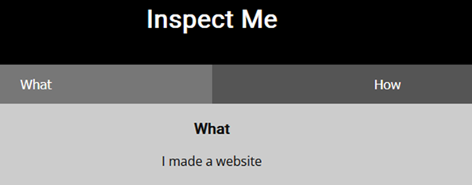
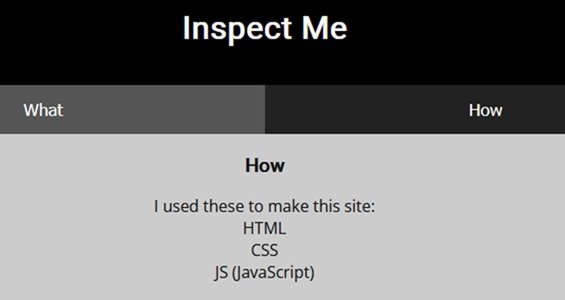
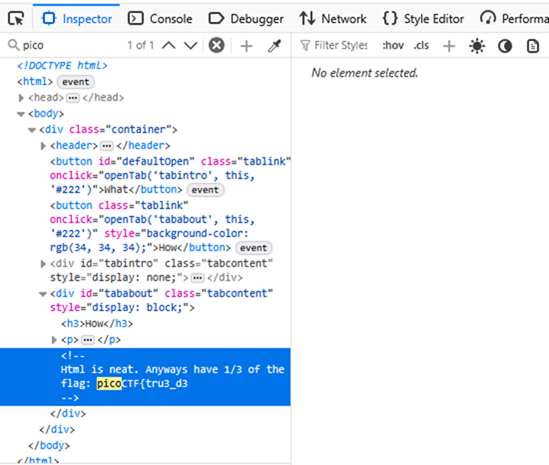
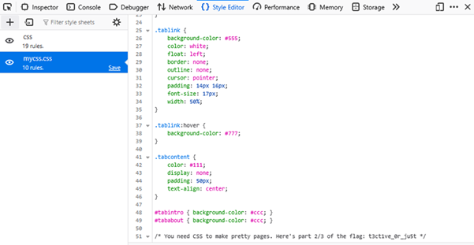
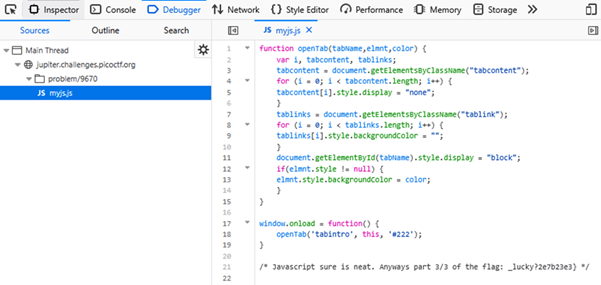

# Insp3ct0r

**Platform:** picoCTF  
**Category:** Web Exploitation  
**Difficulty:** Easy  
**Tags:** `HTML` `CSS` `JavaScript` `DevTools`

---

## Challenge Description

**Author:** zaratec/danny

**Description**

Kishor Balan tipped us off that the following code may need inspection:

Additional details will be available after launching your challenge instance.

---

## Reconnaissance

Navigating to the challenge URL presents a simple webpage consisting of two pages: "What" and "How".

--- 




Clicking **How?** reveals a clue directing you to inspect the page's source files.

This challenge involves locating fragments of a flag hidden in a different client-side file: HTML, CSS, and JavaScript.

---

## Solving the challenge

### 1. Inspect HTML

Open **DevTools** and search the HTML source for `pico`. You find the **first part of the flag** hidden in an HTML comment.



---

### 2. Inspect CSS

Navigate to the **CSS file** to find the **second part of the flag** in a CSS comment.



---

### 3. Inspect JavaScript

Open the **JavaScript file** to find the **final part of the flag** in a JS comment.



Concatenate all parts to get the complete flag.


---
## Flag

```
picoCTF{tru3_xxxxxxxxx_xx_xxxx_xxxxxxxxxxxxxx}
```
*(Flag redacted)*

---

## Key takeaways

| # | Lesson |
|---|--------|
| 1 | All client-side files (HTML, CSS, JavaScript) are fully visible to any user who knows where to look |
| 2 | **Comments in production code**, regardless of file type, are a source of information disclosure. Strip all comments, debug notes, and TODO annotations before deploying to production |
| 3 | Splitting a secret across multiple files provides no real security — an attacker will check all of them |

---
*← [Back to Web Exploitation](../../) | [Back to picoCTF](../../../)*
