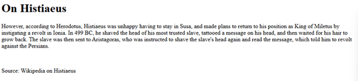
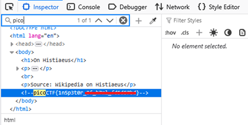

# Inspect HTML

**Platform:** picoCTF  
**Category:** Web Exploitation  
**Difficulty:** Easy  
**Tags:** `html-inspection` `devtools`

---

## Challenge Description

**Author:** LT 'syreal' Jones

**Description**
Can you get the flag?
Additional details will be available after launching your challenge instance.

---

## Reconnaissance

Navigating to the challenge page presents a basic webpage with some text.



---

## Solving the challenge

### 1. Always inspect the source 

1. Open DevTools and search pico in the search bar to find the flag.



---

## Flag

```
picoCTF{1n5p3t0r_xx_xxxx_xxxxxxxx}
```
*(Flag redacted)*

---

## Key takeaways

| # | Lesson |
|---|--------|
| 1 | Flags can be hidden in HTML **attributes and comments**, not just visible text |
| 2 | Developer comments in production code are a common source of accidentally leaked secrets |
| 3 | Remove all debug/developer comments from HTML before deploying to production |

---
*← [Back to Web Exploitation](../../) | [Back to picoCTF](../../../)*
