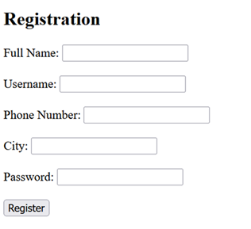
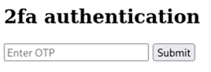
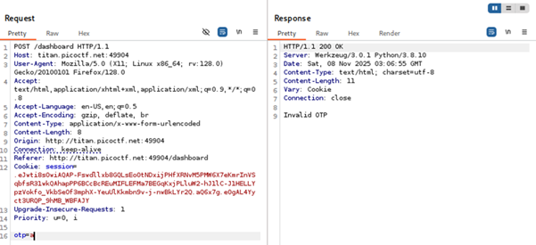
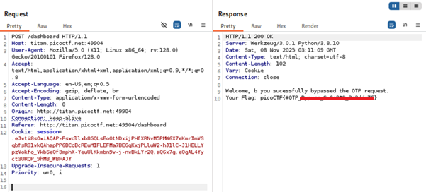

# IntroToBurp

**Platform:** picoCTF  
**Category:** Web Exploitation  
**Difficulty:** Easy  
**Tags:** `Burp Suite` `HTML proxy` `2FA` `Burp Suite repeater`

---

## Challenge Description

**Author:** Nana Ama Atombo-Sackey & Sabine Gisagara

**Description**

Additional details will be available after launching your challenge instance.

---

## Reconnaissance

Navigating to the challenge URL shows a lstandard registration page.

--- 



---

## Solving the challenge

### 1. Turn on Burp Suite proxy (Intercept) to intercept HTTP request

Use **Burp Suite** (configured as a proxy) to **intercept the request**

---

### 2. Register and enter arbitrary One-time Password (OTP)

1. Fill in the required fields and submit. After registering, you are redirected to a **2FA (Two-Factor Authentication)** page asking for a One-Time Password (OTP). Enter any random value as the OTP.



---

### 3. Observe HTTP response
In the raw HTTP request, `otp` is listed as a key-value pair. 
Observe that submitting an invalid OTP returns an error response such as `"Invalid OTP"`.



---

### 4. Send intercepted request to Burp repeater and edit OTP

In Repeater, **remove the `otp` key-value pair entirely** from the request body, then click **Send**.
The server responds with the flag. This reveals that the OTP check can be bypassed simply by omitting the parameter.



---

## Flag

```
picoCTF{#OTP_xxxxxx_xxxxxxx_xxxxxxxx}
```
*(Flag redacted)*

---

## Key takeaways

| # | Lesson |
|---|--------|
| 1 | Burp Suite is an essential tool for web application security testing. Its proxy feature allows you to intercept, inspect, and modify HTTP/HTTPS traffic in real time |
| 2 | **Server-side validation must be robust.** If removing a parameter from a request causes the server to skip a security check, that is a critical vulnerability |
| 3 | Never assume a client will send well-formed, complete requests. Always validate all inputs and enforce all checks server-side regardless of what parameters are (or aren't) present|

---
*← [Back to Web Exploitation](../../) | [Back to picoCTF](../../../)*
