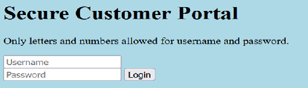
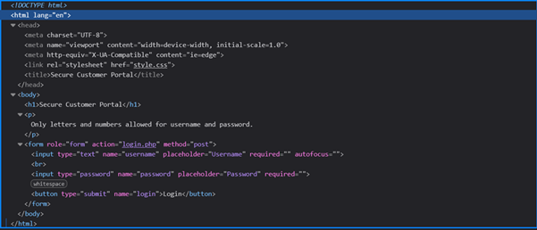
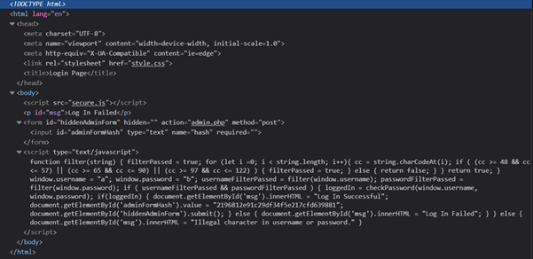
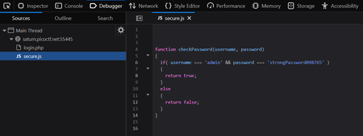

# Local Authority

**Platform:** picoCTF  
**Category:** Web Exploitation  
**Difficulty:** Easy  
**Tags:** `DevTools` `JavaScript` `HTML inspection`

---

## Challenge Description

**Author:** LT 'syreal' Jones

**Description**
Can you get the flag?

Additional details will be available after launching your challenge instance.

---

## Reconnaissance

Navigating to the challenge URL shows a login page that explains that only alphanumeric characters are allowed 
for the username and password.

--- 



---

## Solving the challenge

The alert hints that the flag will be found in source code that may be added using an external file.

### 1. Always inspect the source 

1. Open DevTools and inspect the HTML. Note the structure of the login form.



---

### 2. Enter arbitrary credentials and observe HTML updates

Enter a username and password and submit the form. Observe that the HTML updates and a `<script>` block becomes visible, 
and inline JavaScript code is loaded.

---

### 3. Analyse the JavaScript

The JavaScript uses a function called `checkPassword` to compare the submitted credentials against hardcoded values. The logic works as follows:
   - If credentials match → login succeeds and the flag is displayed.
   - If credentials don't match → displays **"Log in Failed"**.
   - If non-alphanumeric characters are entered → displays **"Illegal character in username or password"**.



---

### 4. Check for linked resources in Debugger

Open the JavaScript file and locate the `checkPassword` function. Inside you will find the hardcoded credentials:
   - **Username:** `admin`
   - **Password:** `strongPassword098765`



Log in with these credentials to retrieve the flag.


---

## Flag

```
picoCTF{j5_xx_xxxxxxxxxxx_xxxxxxxx}
```
*(Flag redacted)*

---

## Key takeaways

| # | Lesson |
|---|--------|
| 1 | **Never implement authentication logic on the client side.** Any JavaScript running in the browser is fully readable by the end user |
| 2 | Always scope out all source files loaded by a web application as cripts, stylesheets, and other resources can contain sensitive logic or hardcoded secret |
| 3 | Authentication decisions must be made **server-side**, where the code cannot be inspected or tampered with by the client|

---
*← [Back to Web Exploitation](../../) | [Back to picoCTF](../../../)*
