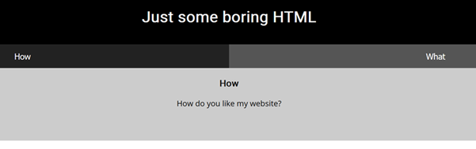
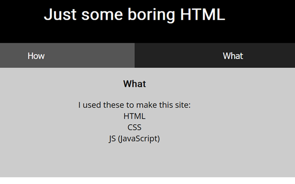
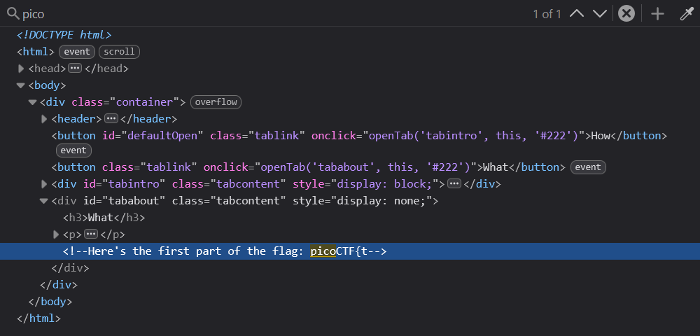
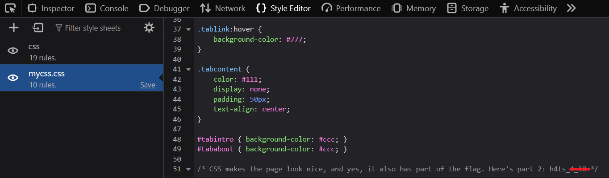
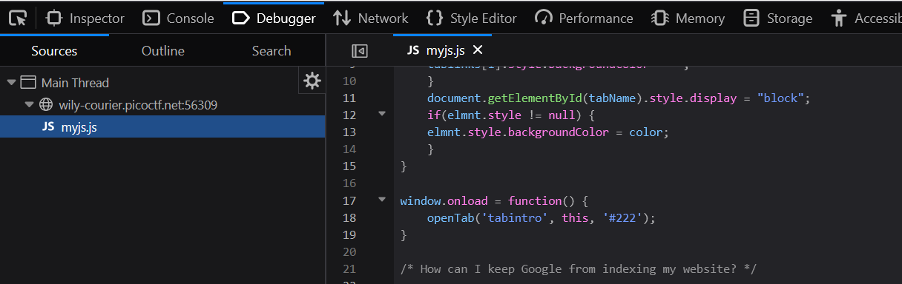
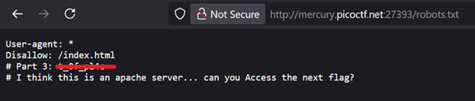
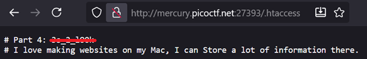
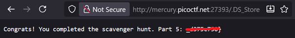

# Scavenger Hunt

**Platform:** picoCTF  
**Category:** Web Exploitation  
**Difficulty:** Easy  
**Tags:** `HTML` `CSS` `JavaScript` `robots.txt` `apache` `.DS_Store`

---

## Challenge Description

**Author:** madStacks

**Description**

There is some interesting information hidden around this site. Can you find it?

Additional details will be available after launching your challenge instance.

---

## Reconnaissance

Navigating to the challenge URL presents a simple webpage consisting of two pages: "How" and "What".

--- 




This challenge involves locating fragments of a flag spread across multiple common web files and endpoints.

---

## Solving the challenge

### 1. Inspect HTML

Open **DevTools** and search the HTML source for `pico`. You find the **first part of the flag** in the HTML.



---

### 2. Inspect CSS

Navigate to the **CSS file** to find the **second part of the flag**.



---

### 3. Inspect JavaScript

Open the **JavaScript file** to find a clue pointing to the next location containing the next part of the flag.



---

### 4. Inspect robots.txt

The clue references blocking search engine indexing. A common method for this is the **`robots.txt`** file, placed at the root of a website. Navigate to:
   ```
   <challenge_url>/robots.txt
   ```
   You find the **fourth part of the flag**.

To block all search engine crawlers use the following format:
   ```
   User-agent: *
   Disallow: /
   ```

Another clue is given to access the next part of the flag. It suggests the site may be hosted on an **Apache server**.



---

### 5. Apache server files

Common Apache-specific files include `/server-status`, `/server-info`, `/.git`, and `/.htaccess`. Navigate to:
   ```
   <challenge_url>/.htaccess
   ```
   You find the **fifth part of the flag**.

**`/.htaccess` is a configuration file used by Apache servers to control the behaviour of a website or directory without modifying the main server configuration for example URL redirects, access control/ authentication and custom error pages

Another clue is also given "I love making websites on my Mac, I can Store a lot of inofrmation there."



---

### 6. .DS_Store

The final clue references macOS. The **`.DS_Store`** file is a hidden file automatically created by macOS that stores folder metadata such as icon positions, background images, and file/directory names. This can inadvertently leak directory structure information when uploaded to a web server. Navigate to:
   ```
   <challenge_url>/.DS_Store
   ```
   You find the **final part of the flag**. 



Concatenate all parts to get the complete flag.


---
## Flag

```
picoCTF{th4ts_x_xxx_xx_xxxxxx_x_xxxx_xxxxxxxx}
```
*(Flag redacted)*

---

## Key takeaways

| # | Lesson |
|---|--------|
| 1 | Web applications expose far more than just their main pages. Always check auxiliary files such as `robots.txt`, `.htaccess`, `.DS_Store`, `.git/`|
| 2 | **`robots.txt`** is publicly readable by design. Never use it to hide sensitive paths, as it advertises them to anyone who looks |
| 3 | **`.DS_Store` files should never be deployed to a web server.** They can leak internal directory and file names, aiding an attacker's reconnaissance |
| 4 | Hidden or configuration files left accessible in a web root are a common source of information disclosure vulnerabilities |

---
*← [Back to Web Exploitation](../../) | [Back to picoCTF](../../../)*
