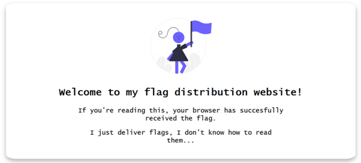
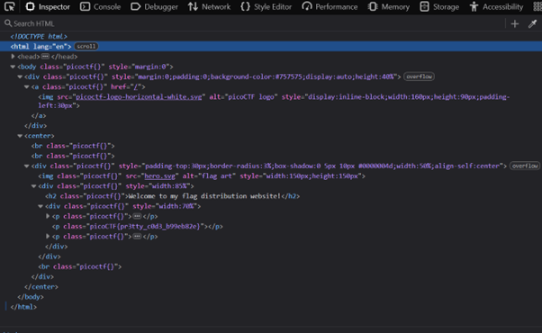
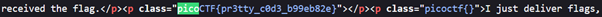

# Unminify

**Platform:** picoCTF  
**Category:** Web Exploitation  
**Difficulty:** Easy  
**Tags:** `html-inspection` `source-code` `devtools` `curl`

---

### Challenge Description

**Author:** Jeffery John

**Description**
I don't like scrolling down to read the code of my website, so I've squished it. As a bonus, my pages load faster!
Additional details will be available after launching your challenge instance.

---

## Reconnaissance

Navigating to the challenge page presents a basic webpage. It looks ordinary on
the surface — nothing jumps out visually.



---

## Solving the challenge

There are three ways of solving this challenge. These methods are considered as reconnaissance as we are gathering information about the target.

### Method 1: Browser DevTools

1. Open the browser's inspect tool (`F12` or right-click → Inspect)
2. Expand each element in the Elements panel and walk through the DOM tree until you spot the flag buried in the markup.



### Method 2: View Page Source

1. As the challenge hint suggests, use `Ctrl + U` to open the raw page source
in a new tab
2. Because the HTML is minified into a single long line, you will
need to search (`Ctrl + F`) for `picoCTF` to jump straight to the flag.



### Method 3: curl

1. Run the following command from a terminal to retrieve the raw HTML to your
terminal, then scan it for the flag using 'grep':

```bash
curl -s 'http://titan.picoctf.net:54768/' | grep -o 'picoCTF{[^}]*}'
```


---

## Flag

```
picoCTF{pr3tty_xxxx_xxxxxxxx}
```
*(Flag redacted)*

---

## Key takeaways

| # | Lesson |
|---|--------|
| 1 | **Minification** strips whitespace, comments, and formatting to reduce file size, but the content is functionally identical — the flag is still there |
| 2 | Browsers parse and pretty-print minified HTML in DevTools, making the Elements panel useful even when the source is a single line |
| 3 | `Ctrl + U` (View Page Source) and `curl` are fast alternatives to DevTools |
| 4 | Piping `curl` output into `grep` is a quick CTF trick to extract flags without combing through large HTML responses |

