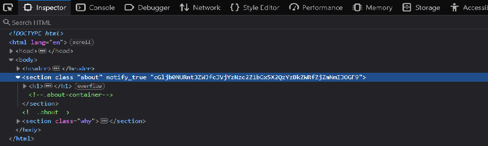
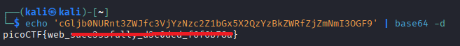

# WebDecode

**Platform:** picoCTF  
**Category:** Web Exploitation  
**Difficulty:** Easy  
**Tags:** `html-inspection` `rot13` `burpsuite` `devtools`

---

## Challenge Description
**Author:** Nana Ama Atombo-Sackey

**Description**
Do you know how to use the web inspector?

Additional details will be available after launching your challenge instance.

---

## Reconnaissance

The challenge URL loads a site with three pages: **Home**, **About**, and
**Contact**. The challenge hint tells you to use the browser's inspect tool —
so something meaningful is hiding in the HTML rather than the rendered text.

---

## Solving the challenge

There are two ways to send this modified request:

### 1. Inspect every page

Navigate to the **About** page, open DevTools, and examine the
Elements panel.

### 2. Find the encoded string

Inside the `<body>` of the About page you will find a suspicious string of
characters that is not displayed on screen. It looks like Base64 or a similar
encoding scheme.



### 2. Decode the string

Copy the string and decode it. For Base64 you can use:

```bash
echo 'cGljb0NURnt3ZWJfc3VjYzNzc2Z1bGx5X2QzYzBkZWRfZjZmNmI3OGF9' | base64 -d
```


Or paste it into an online decoder such as [CyberChef](https://gchq.github.io/CyberChef/).

The decoded output is the flag.

---

## Flag

```
picoCTF{web_xxxxxxxxxxxx_xxxxxxx_xxxxxxxx}
```
*(Flag redacted)*

---

## Key takeaways

| # | Lesson |
|---|--------|
| 1 | **Inspect every page**, not just the landing page — secrets are often on secondary routes |
| 2 | Flags can be hidden in HTML **attributes and comments**, not just visible text |
| 3 | **Base64** is recognisable by its alphanumeric characters and `=` padding at the end |
| 4 | Tools like CyberChef and the `base64` CLI command are essential for quick decoding |

---
*← [Back to Web Exploitation](../../) | [Back to picoCTF](../../../)*

