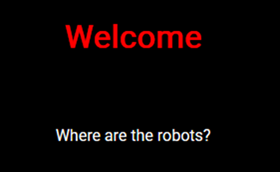
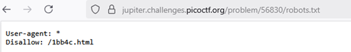
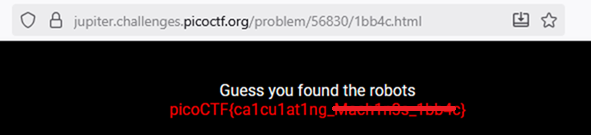

# Where are the robots

**Platform:** picoCTF  
**Category:** Web Exploitation  
**Difficulty:** Easy  
**Tags:** `robots.txt`

---

## Challenge Description

**Author:** zaratec/Danny

**Description**

Can you find the robots?

Additional details will be available after launching your challenge instance.

---

## Reconnaissance

1. Navigating to the challenge URL presents a simple basic webpage.

--- 



---

## Solving the challenge

### 1. Go to robots.txt
The challenge title "Where are the robots", is a direct hint. **`robots.txt`** is a standard text file placed at the root of a website to instruct search engine crawlers which pages they are allowed or disallowed from indexing. Navigate to:
   ```
   http://jupiter.challenges.picoctf.org/problem/56830/robots.txt
   ```

The `robots.txt` file contains a `Disallow` entry pointing to a specific endpoint (e.g., `/1bb4c.html`).



---

### 2. Navigate to given endpoint

Navigate directly to that endpoint in your browser. The flag is displayed there.



---

## Flag

```
picoCTF{ca1cu1at1ng_xxxxxxxx_xxxxx}
```
*(Flag redacted)*

---

## Key takeaways

| # | Lesson |
|---|--------|
| 1 | This challenge introduces `robots.txt`, which is a publicly accessible file that can inadvertently reveal sensitive paths and endpoints |
| 2 | Any path listed under `Disallow` is effectively advertised as "something we don't want people to find |
| 3 | Never rely on `robots.txt` to hide sensitive pages or directories. Use proper **authentication and access controls** instead |
| 4 | Checking `robots.txt` is a standard first step in web reconnaissance and is covered by automated scanning tools |


---
*← [Back to Web Exploitation](../../) | [Back to picoCTF](../../../)*
