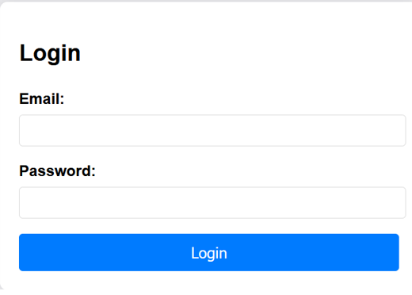
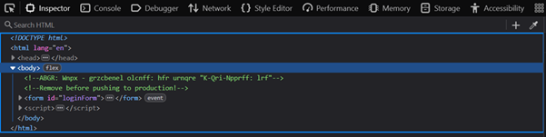
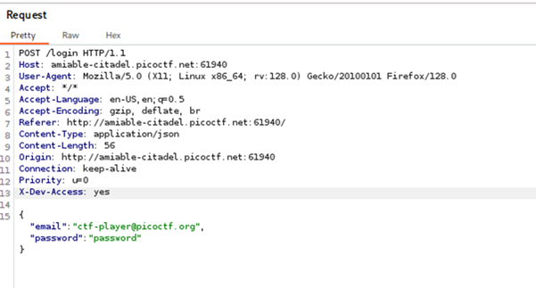
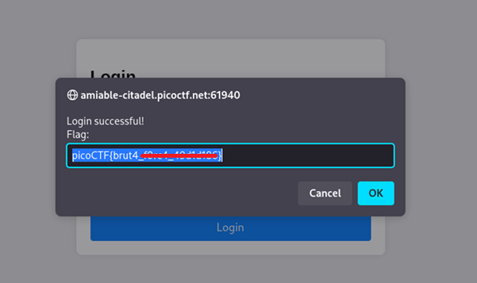
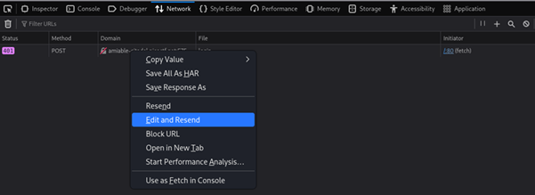
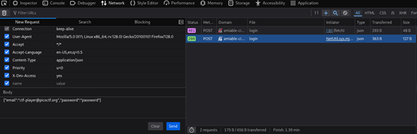
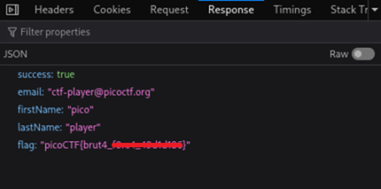

# Crack the Gate 1

**Platform:** picoCTF  
**Category:** Web Exploitation  
**Difficulty:** Easy  
**Tags:** `http-headers` `html-inspection` `rot13` `burpsuite` `devtools`

---

## Challenge Description
**Author:** Yahaya Meddy

**Description**

We’re in the middle of an investigation. One of our persons of interest, ctf player, is believed to be hiding sensitive data inside a restricted web portal. We’ve uncovered the email address he uses to log in: ctf-player@picoctf.org. Unfortunately, we don’t know the password, and the usual guessing techniques haven’t worked. But something feels off... it’s almost like the developer left a secret way in. Can you figure it out?

Additional details will be available after launching your challenge instance.

---

## Reconnaissance

Navigating to the challenge URL presents a standard login page.



**First step — always inspect the source.** Opening DevTools and examining
the HTML body reveals a comment that should never have made it to production:



The comment contains an encoded string. The hint — *"rotate each letter by
13 spaces"* — points to **ROT13**.

---

## Decoding the Hint

Applying ROT13 to the encoded comment reveals:

```
NOTE: Jack - temporary bypass: use header "X-Dev-Access: yes"
```

This tells us a **custom HTTP header** can be used to bypass authentication
entirely — a header that should have been removed before deployment.

---

## Exploitation

There are two ways to send this modified request:

---

### Method 1: Burp Suite

1. Enable **Intercept** in the Burp Suite Proxy tab
2. Attempt to log in with any credentials
3. Intercept the POST request and add the header:
```
   X-Dev-Access: yes
```
4. Forward the request



The page responds with an alert containing the flag.



---

### Method 2: Browser DevTools (No Tools Required)

1. Open DevTools → **Network** tab
2. Attempt a login
3. Right-click the failed request → **Edit and Resend**



4. Scroll to the request headers and add:
```
   X-Dev-Access: yes
```



5. The new request returns **HTTP 200**
6. Inspect the **Response** — the flag is returned as JSON



---

## Flag

```
picoCTF{brut4_xxxxx_xxxxxxxx}
```
*(Flag redacted)*

---

## Key takeaways

| # | Lesson |
|---|--------|
| 1 | **Never trust client-controllable HTTP headers** for access control decisions |
| 2 | **Remove all debug/developer comments** from HTML before deploying to production |
| 3 | Sensitive instructions or credentials in source code are a serious vulnerability |
| 4 | Always inspect page source and network traffic — both can reveal hidden information |
| 5 | Burp Suite and DevTools are both valid interception tools depending on context |

---

## 🔗 References

- [ROT13 - Wikipedia](https://en.wikipedia.org/wiki/ROT13)
- [HTTP Headers - MDN](https://developer.mozilla.org/en-US/docs/Web/HTTP/Headers)
- [Burp Suite Documentation](https://portswigger.net/burp/documentation)
- [picoCTF](https://picoctf.org)

---

*← [Back to Web Exploitation](../../) | [Back to picoCTF](../../../)*
