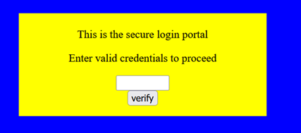
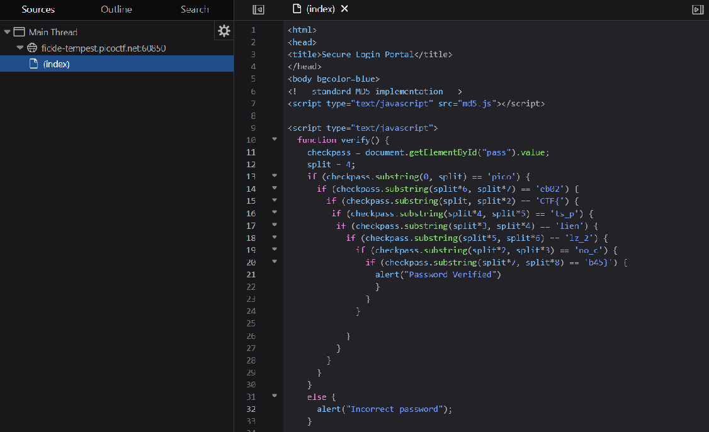
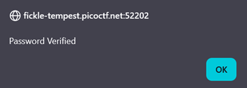

# dont-use-client-side

**Platform:** picoCTF  
**Category:** Web Exploitation  
**Difficulty:** Easy  
**Tags:** `DevTools` `JavaScript`

---

## Challenge Description

**Author:** Alex Fulton/Danny

**Description**
Can you break into this super secure portal?

Additional details will be available after launching your challenge instance.

---

## Reconnaissance

Navigating to the challenge URL shows a page with a simple text input field and a "Verify" button. The goal would be to find whatever value passes verification.

--- 



---

## Solving the challenge

### 1. Inspect the JavaScript

Open DevTools. Navigate to the **Debugger** panel. Find the inline `<script>` block 
that handles the form submission. 

### 2. Navigate to each file and read the comments

Click each file path (or copy the URL and open it in a new tab) to view its
raw contents.

Alternatively, use the **Sources** (Chrome) or **Debugger** (Firefox) panel in
DevTools to browse all loaded files.

The JavaScript contains the verify function. Rather than checking against
a value stored on the server, the entire check happens in the browser. The
code splits the flag into chunks of four characters and compares them
individually.



### 3. Reconstruct the flag

Concatenate all the string chunks in order. The result is both the correct
password and the flag itself.



---

## Flag

```
picoCTF{no_xxxxxxx_xxx_xxxxxxxx}
```
*(Flag redacted)*

---

## Key takeaways

| # | Lesson |
|---|--------|
| 1 | **Never perform sensitive validation on the client side** as all JavaScript sent to the browser can be read by the user |
| 2 | Obfuscating a secret by splitting it into chunks provides **no real security** |
| 3 | Authentication and authorisation checks must always be enforced **server-side**, where the user cannot inspect or manipulate the logic |
| 4 | This is a classic example of **security through obscurity** which is not security at all |

---
*← [Back to Web Exploitation](../../) | [Back to picoCTF](../../../)*
