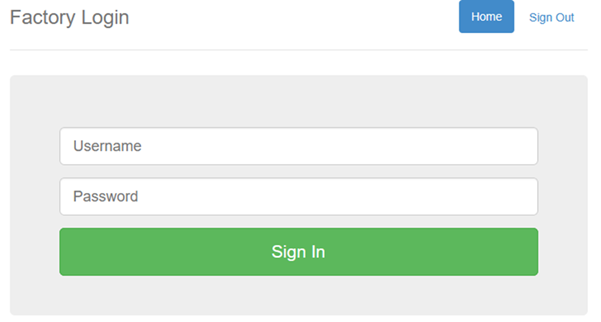
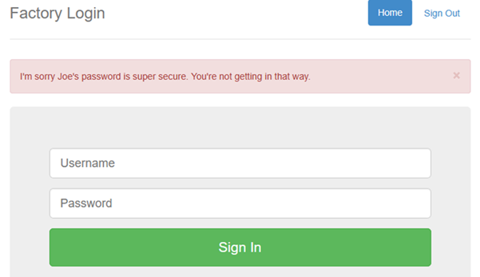
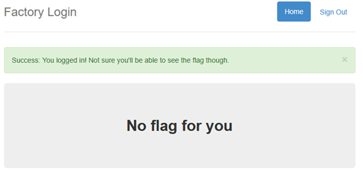
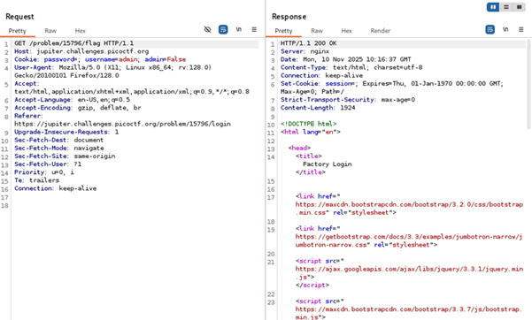
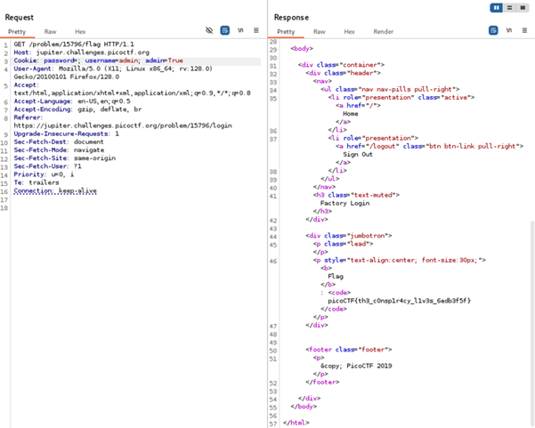

# logon

**Platform:** picoCTF  
**Category:** Web Exploitation  
**Difficulty:** Easy  
**Tags:** `Burp Suite` `Burp Repeater` `cookies` `HTML Headers`

---

## Challenge Description

**Author:** bobson

**Description**

The factory is hiding things from all of its users.

Additional details will be available after launching your challenge instance.

---

## Reconnaissance

1. Navigating to the challenge URL presents a simple login page.

--- 



2. The challenge description says to log in as **Joe**, but the hint notes that the application only checks Joe's password, no one else's.

3. Attempting to log in as `joe` fails with a red error. However, logging in as **any other username** (even without a password) succeeds and shows a green "Logged in" banner, but no flag.




---

## Solving the challenge

### 1. Intercept the successful login request using Burp Suite

Intercept the successful login request using **Burp Suite** and examine the HTTP headers. In the **Cookie** header, you will find a key-value pair:
   ```
   admin=False
   ```



---

### 2. Change cookie value using Burp Repeater

**Send this request to Burp Repeater**. Change the cookie value to:
   ```
   admin=True
   ```
   Then send the request.

The server now treats you as an admin and returns the flag.



---

## Flag

```
picoCTF{th3_xxxxxxxxxx_xxxxx_xxxxxxxx}
```
*(Flag redacted)*

---

## Key takeaways

| # | Lesson |
|---|--------|
| 1 | **Never use client-controlled storage (cookies) for authorisation decisions without integrity protection.** If a cookie like `admin=False` can simply be changed to `admin=True` by the client, there is no real access control|
| 2 | Authorisation state should be managed **server-side** (e.g., via server-side sessions), not stored in a plaintext cookie that the client can freely modify |
| 3 | If cookies must store sensitive state, they should be **cryptographically signed** (e.g., using HMAC) so any tampering is detectable |


---
*← [Back to Web Exploitation](../../) | [Back to picoCTF](../../../)*
